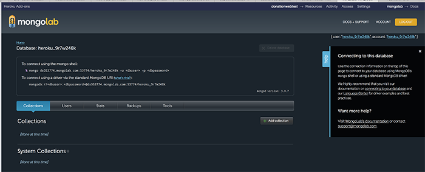

# Step 04 - Heroku & MongoLab

As previously mentioned, you app failed to launch due to no backend database present - this final step will take you through the process of setting up a mongodb database via Heroku's addon <b>MongoLab</b>

## THE END!