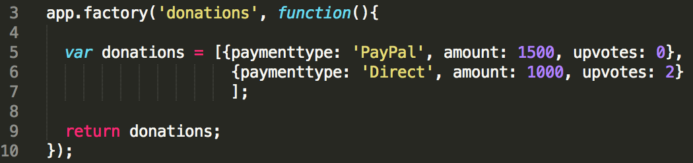

#Step 3 - 'View All Donations'

With any application that will be listing some data it's always a good idea to get the 'Display/list/View All' option implemented first, if for no other reason, to confirm that what you have in the 'app' can be viewed in the 'app' and that you can confirm your 'add' works pretty much instantly.

So the first feature we'll implement is our **'View All Donation'** and initially list a few 'donations' we'll create in our **factory**. Before we start, have a look again at what we want our completed page to look like


We want to initially display 2 records (just so we know it works) on our page in the format above and also be able to delete the record (and eventually edit it). To achieve this we need to pass or ***inject*** our list of donations object into our **'donationsController'** - so let's do that.

---

## Setting Up our 'List of Donations'

Have a quick look again at our list we declared in our **factory**, just to familiarise yourself with the data you'll be displaying



We need to somehow allow our 'donationsController' access to this list so that we can display it on our donations page. We can achieve this through ***Dependency Injection*** so replace your existing controller with the following

```javascript

app.controller('donationsController', function($scope, donations) {
    // create a message to display in our view
    $scope.message = 'Donations Page!';
    $scope.donations = donations;
  });

```
Be clear about what is happening here and how we use the ***$scope*** object to allow access in our ***view*** (our donations.html).

---

## Displaying our 'List of Donations'

Everything we need to display our list of donations is already implemented in our **'donations.html'** page (as per the solution) but you should investigate how we actually achieve the rendering of the list and familarise yourself with the different ***angular directives*** used in the solution, below is an extract from the page but it's worth having a look at the complete html at some stage.

