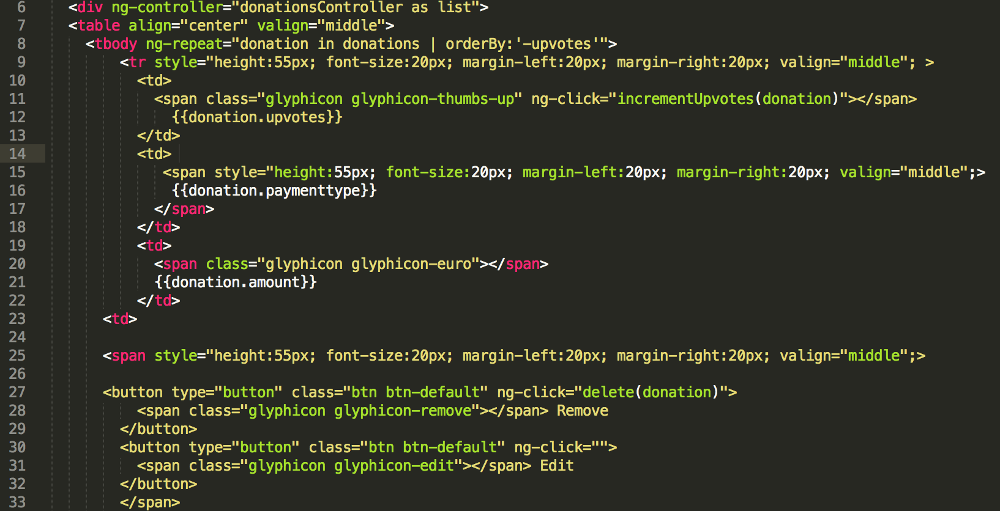
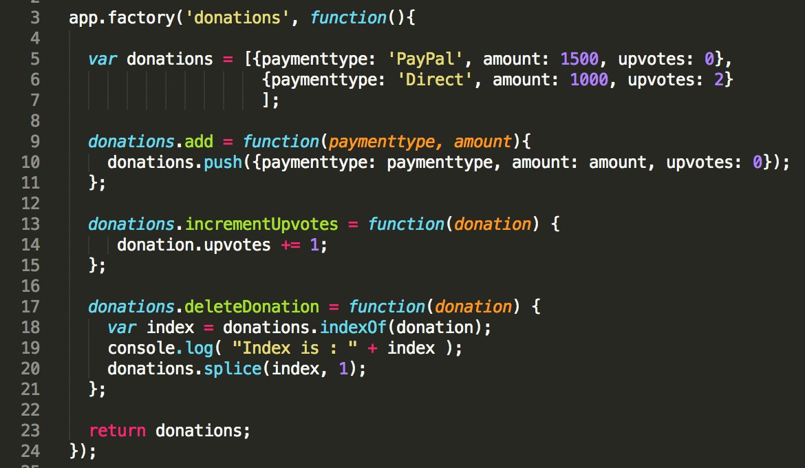

# Step 5 - 'Delete' and 'UpVotes'

Now that we can display a list of our donations and add an individual donation, the final features we need implement (at this stage anyway) is our **'Delete'** option where the user can *Remove* a single donation and also give a donation the *thumbs Up* or increase its **UpVotes**. Before we continue, have a look again at what our donations page looks like


What we need to do here is write 2 functions, one called **deleteDonation** to *delete* a donation and another called **incrementUpvotes** to increase its *upvotes* property - both of which need to be added to our factory.

---

## The *factory* 'deleteDonation' function

Here's the implemented function all ready to go, so just insert it correctly into our factory object in app.js. Make sure you understand how this works and more importantly the relevance of passing a ***donation*** reference to the function

```javascript

donations.deleteDonation = function(donation) {
    var index = donations.indexOf(donation);
    console.log( "Index is : " + index );
    donations.splice(index, 1);  
  };

```

The next step is to 'wire up' the click of the Delete Button on our view, with the deleteDonation function you just implemented - we'll achieve this, once again, through a ***callback function***.

---

## Updating our *donationsController* - the 'deleteDonation' Callback

Firstly, have a look at our existing donations.html page, and specifically the **ng-click** directives associated with the delete button and the 'thumbs Up' glyphicon.



These are the functions you need to write within the donations controller.

To help you along, you need to add the following function to the controller - which you need to complete.

```javascript
   $scope.delete = function(donation){
      if (confirm("Are you sure you want to delete?")) {
          //Call the factory delete function here
         }       
      };
```

Once you've completed the 'delete' feature, save the file and test it out by adding, and then deleting a few donations.

---

## Updating our *donationsController* - the 'incrementUpvotes' Callback

The last feature to implement is to give a particular donation the *thumbs Up*, by implementing the **incrementUpvotes** function in our **factory** and our **controller**.

Here's the function for our factory

```javascript
donations.incrementUpvotes = function(donation) {
     donation.upvotes += 1;
  };
```
but try and have a go at the function for our controller.

**Observe what happens when you click on the thumb icon.... and more importantly how does it work**

---
As a wrap up, your completed **factory** should look like this



and your **controller** should look like this


## Well Done!!


