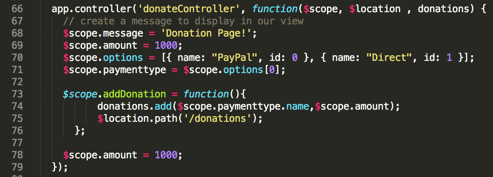

# Step 5 - 'Delete' and 'UpVotes'

Now that we can display a list of our donations and add an individual donation, the final features we need implement (at this stage anyway) is our **'Delete'** option where the user can *Remove* a single donation and also give a donation the *thumbs Up* or increase its **UpVotes**. Before we continue, have a look again at what our donations page looks like


What we need to do here is write 2 functions, one called **deleteDonation** to *delete* a donation and another called **incrementUpvotes** to increase its *upvotes* property - both of which need to be added to our factory.

---

## The *factory* 'deleteDonation' function

Here's the implemented function all ready to go, so just insert it correctly into our factory object in app.js. Make sure you understand how this works and more importantly the relevance of passing a ***donation*** reference to the function

```javascript

donations.deleteDonation = function(donation) {
    var index = donations.indexOf(donation);
    console.log( "Index is : " + index );
    donations.splice(index, 1);  
  };

```

The next step is to 'wire up' the click of the Delete Button on our view, with the deleteDonation function you just implemented - we'll achieve this, once again, through a ***callback function***.

---

## Updating our *donationsController* - the 'deleteDonation' Callback

Firstly, have a look at our existing donations.html page, and specifically the **ng-click** directives associated with the delete button and the 'thumbs Up' glyphicon.


what function gets triggered when the Donate Button is clicked (when the form is submitted)?

Also, what form **data** is submitted (look for the **ng-model** directives)?

This is the information you need to write the callback function within the controller (below).


To help you along, you'll need to ***inject*** the 'donations' list into the controller (similar to the previous lab with the donationsController) to get access to the list and you'll also need to add the following function to the controller - which you need to complete.

```javascript
$scope.addDonation = function(){
          donations.add(... , ...);
          
      };
```

Once you've completed the 'add' feature, you'll notice that you must manually select the 'View All Donations' link to see your newly added donation. To make thinks a bit more user-friendly we can use the ***$location*** object to *automatically* redirect the user to the page we want.

So if you modify your controller to look something like this



once you add a donation you should be redirected to the relevant page. Again, just be clear about how this is achieved before moving on to the next step.


