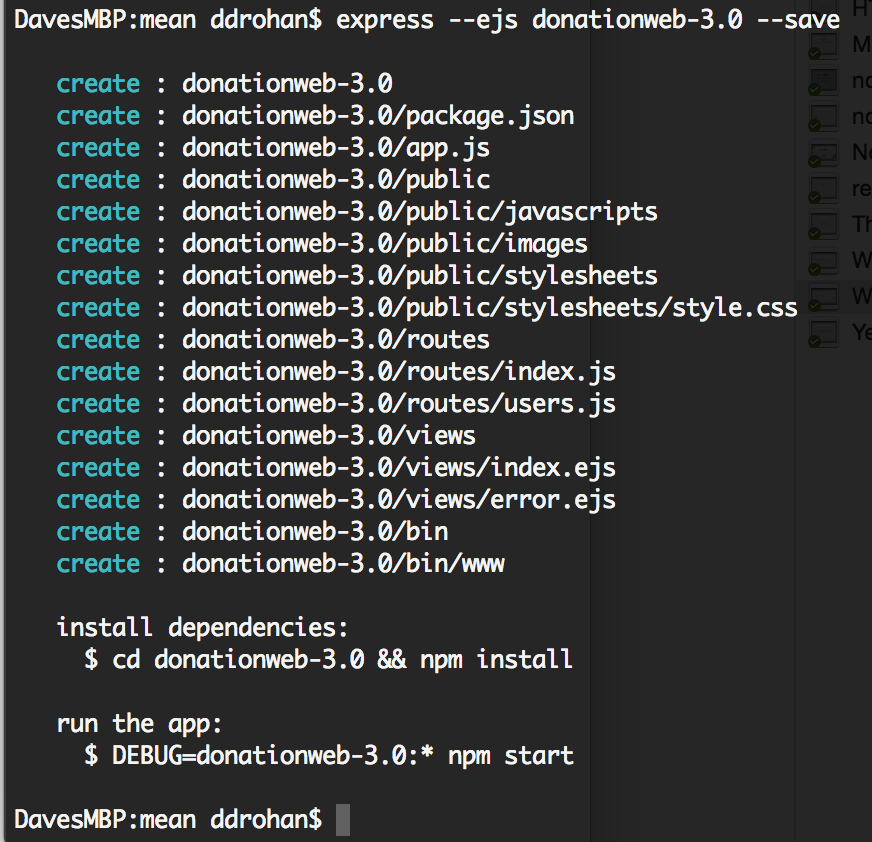
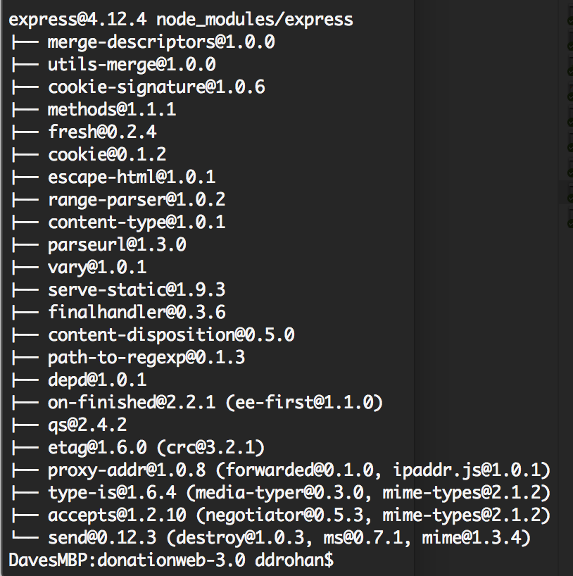
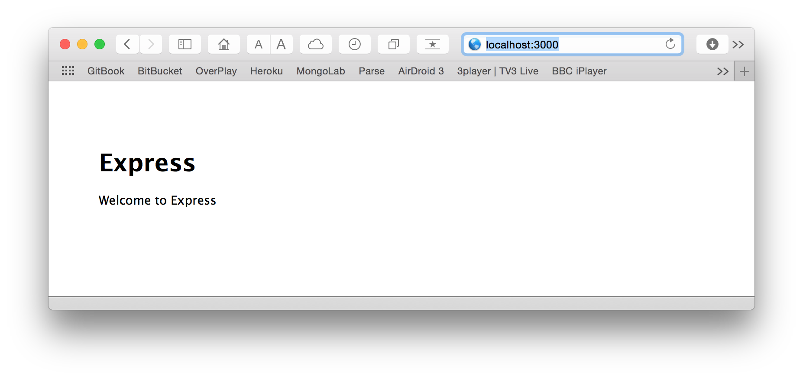

# Step 2 - Setup

First thing you should do is download the starter code (or the solution to the previous lab) **[here](../zips/donationweb-2.0.solution.zip)** and then extract it to your single parent folder for all your web app projects you created for previous labs. 

This time, **DON'T** rename the extracted folder, as we only need to copy the Angular files into a new NodeJS app.

We're going to build our node web app using **express**, so (assuming you already have it installed) navigate to your parent web app folder and type the following

```
express --ejs donationweb-3.0 --save

```
and you should get something like this



As you can see, this will auto-generate a node web app, creating all the necessary folders and files we need to get started. *--ejs* specifies we want to use the **Embedded JavaScript Templates** (instead of the default which is Jade) and *--save* just ensures the dependencies are added to our *package.json* file (more on this later).

Now, follow the instructions to install the dependencies, and you should get something like this (+ a lot more!)



And once you've dragged it into Sublime Text you should have something like this


Finally, navigate to your **donationweb-3.0** folder and type the following to launch the server

```
npm start

```

if everything goes to plan you should be able to visit [http://localhost:3000](http://localhost:3000) and see the following



The next step will involve bringing in our angular files to get the front-end implemented.